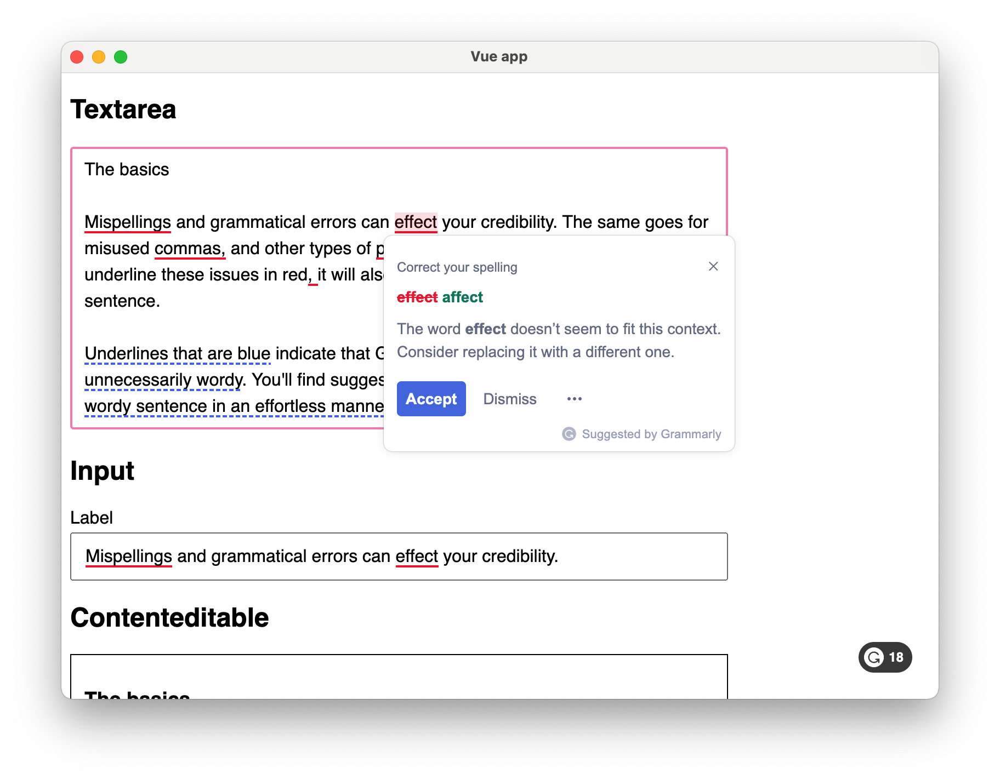

# Electron Demo App With Vue

This is a sample [Electron](https://www.electronjs.org) app built with Vue to demo the Grammarly SDK integration.

## How to run the app

The instructions below will walk you through how to install, build, and run the app with basic functionality.

1. Clone this repo to your machine
1. Install the necessary dependencies: `npm install`
1. Create a new application with a desktop client in the [Grammarly Developer Hub](https://developer.grammarly.com/apps)
1. Add a new **Desktop** (not Web) client to your application
1. Copy the **Client ID** for your Desktop client
1. Open [src/components/demo.js](src/components/demo.js) on your local machine
1. Replace `demoClientId` with the **Client ID** for your app
1. Build the app: `npm run build-vue`
1. Start the app: `npm start`

The Electron app will open. When you click inside one of the text fields, Grammarly will underline text that can be improved. The Grammarly button will also appear in the lower-right corner of the app and display the total number of suggestions. 

### Turning on Connected Accounts

You'll need to complete a few extra steps if you would like to turn on [Connected Accounts](https://developer.grammarly.com/docs/connected-accounts). Connected Accounts allows users to connect their personal Grammarly accounts with your app.

1. Navigate to the desktop client configuration page for your app in the [Grammarly Developer Hub](https://developer.grammarly.com/apps)
1. Add the following as a Redirect URI: `example://grammarly-auth/`. Note that this matches the Redirect URI that the app configures in [Editors.js](src/components/Editors.vue)
1. Navigate to the **Connected Accounts** page for your app in the [Grammarly Developer Hub](https://developer.grammarly.com/apps)
1. Turn **on** Connected Accounts
1. Input the required information and click **Save**
1. Reload your Electron app

When you click the Grammarly button in the lower-right corner of your app, you will now see an option to **Connect your Grammarly account**. You can choose to connect your personal Grammarly account, so that Grammarly will make suggestions based on your account's features and preferences.
